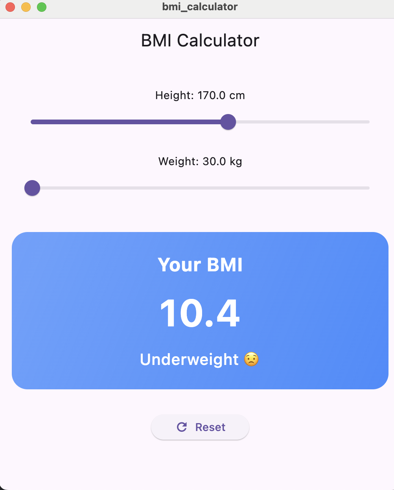
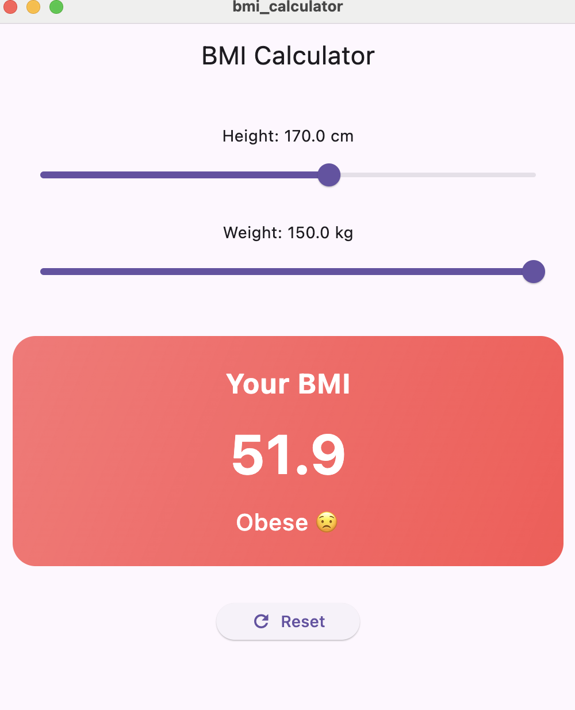
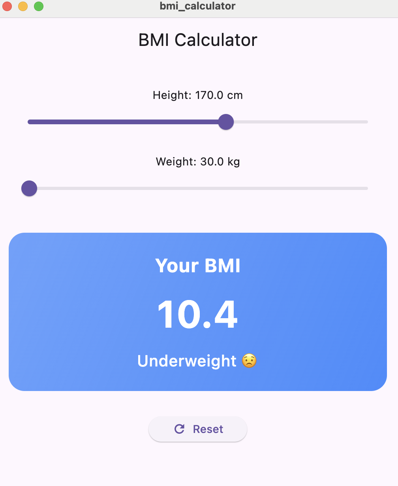

# 🧮 BMI Calculator App (Flutter)

A fun and interactive BMI (Body Mass Index) calculator built with Flutter.  
Users can input their height and weight using sliders, and the app calculates and displays BMI in real-time — complete with visual feedback and BMI category.

---

## ✨ Features

- 🎚️ Adjustable sliders for height (cm) and weight (kg)
- ⚡ Instant BMI calculation on slider movement
- 🎨 Gradient container showing the BMI result
- 💡 BMI category display (Underweight, Normal, Overweight, Obese) with emoji
- 🔄 Reset button to restore default values
- ✅ Responsive and clean UI using Flutter widgets

---

## 📸 Screenshots

---

